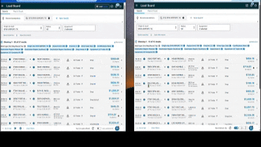

# 🚚 Amazon Relay Cross-Company Auto Booker

---

## 🎬 Demo

[Watch Demo](https://www.youtube.com/watch?v=QAJBOvElFkE)



---

## ⚡ Core Idea (Main Feature)

This extension enables **cross-account load booking between different Amazon Relay company profiles**.

👉 Example:

* **Company A (Profile 1)** → Performance Score: **A**
* **Company B (Profile 2)** → Performance Score: **A+**

💡 Normally:

* Lower-rated profiles cannot book high-priority loads

🚀 With this extension:

* You can **use a higher-rated company profile (A+)**
* To instantly **book loads for another company’s board (A-level)**
* And secure them in ~2 seconds

👉 This creates a **major competitive advantage** in load booking

---

## 📈 Real-World Results

* 💰 Generated **$150,000+ additional gross revenue** personally
* 🏢 Helped **5+ companies each earn $50,000+** using this approach
* ⚡ Consistently outperformed standard manual booking speeds
* 🎯 Enabled access to loads typically dominated by top-tier profiles

---

## 🔥 Key Features

* ⚡ **Cross-account automation** (core innovation)
* 🚀 Reduces booking time from **~10 seconds → ~2 seconds**
* 🤖 Automates the **“Post a Truck”** workflow
* 🎯 Enables access to **higher-priority loads**
* 💼 Improves dispatch efficiency and speed

---

## 🧠 How It Works

The extension connects workflow between **two Amazon Relay company profiles**:

1. Monitor loads from one company profile
2. Instantly trigger **Post a Truck** from another (higher-rated) profile
3. Auto-fill and submit faster than manual interaction
4. Secure loads before competitors

---

## 🛠️ Tech Stack

* JavaScript
* HTML / CSS
* Chrome Extensions API

---

## 📦 Installation

1. Download or clone this repository
2. Open Chrome:

   ```
   chrome://extensions/
   ```
3. Enable **Developer mode**
4. Click **Load unpacked**
5. Select the project folder

---

## ⚠️ Disclaimer

This project is for **educational purposes only**.
Use responsibly and ensure compliance with Amazon Relay’s terms of service.

---

## 👨‍💻 Author

**Mukhammadiusuf Sirozhiddinov**
📍 Osh, Kyrgyzstan
📧 [sirozhiddinovmukhammadiusuf@gmail.com](mailto:sirozhiddinovmukhammadiusuf@gmail.com)

---

## ⭐ Future Improvements

* Multi-account management dashboard
* Smart load filtering
* Performance tracking tools
* Improved automation logic

---

## 📄 License

MIT License
